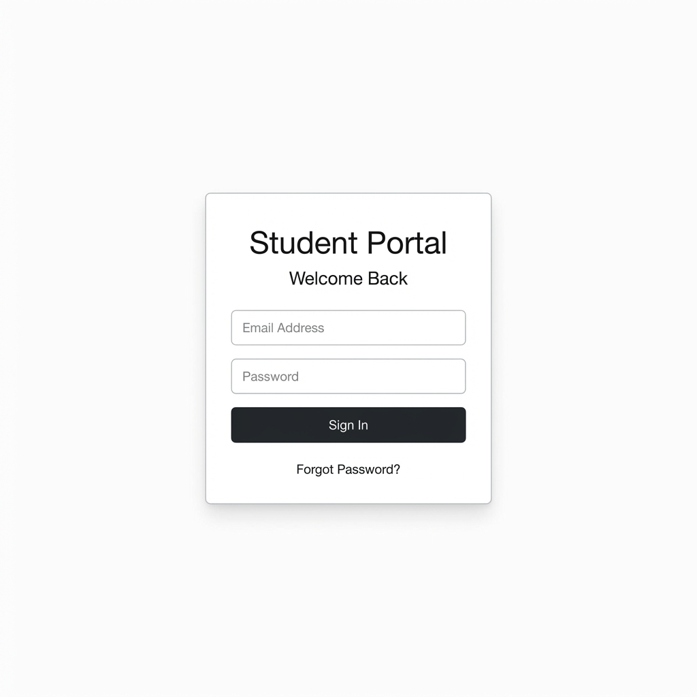
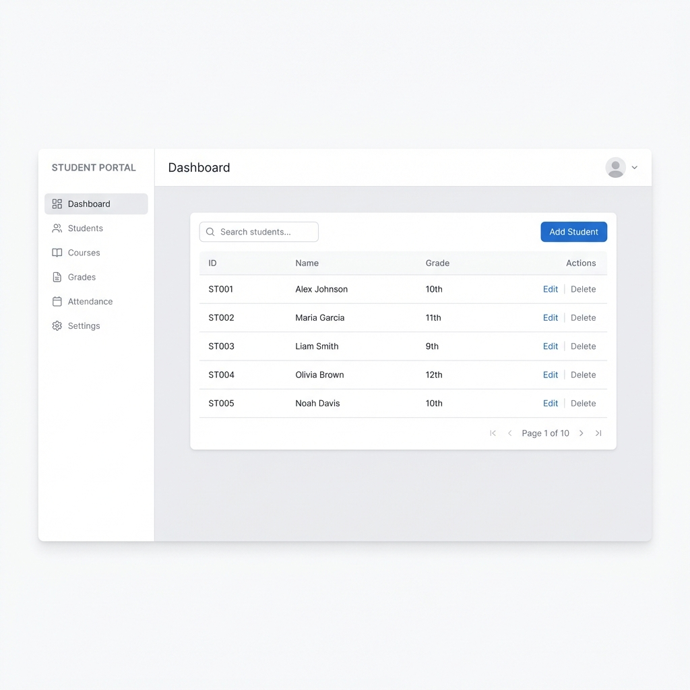

# Belgium Campus Student Portal



A modern student management application built with **Java Spring Boot**. This project combines a secure student portal with a powerful admin dashboard for managing student records and registrations, styled with a sleek Glassmorphism aesthetic.

## Features

-   **Student Portal**: Secure login and registration for students to access their profiles.
-   **Admin Dashboard**: A centralized interface for administrators to manage student data.
-   **CRUD Operations**: Full Create, Read, Update, and Delete capabilities for student records.
-   **Modern UI**: Designed with a responsive Glassmorphism interface for a premium user experience.

## Privacy Notice

> [!IMPORTANT]
> **This project involves personal data and is intended for private use.**
> Please ensure that you do not inadvertently publish sensitive personal information if you decide to fork or share this repository.
> The code in this repository is **not freely public** and is proprietary to the owner.

## Dashboard Preview



## Getting Started

Follow these steps to set up the project locally.

### Prerequisites

-   **Java Development Kit (JDK) 17** or higher
-   **Maven** (Wrapper included in the project)

### 1. Install Dependencies

navigate to the project directory and install dependencies using Maven:

```bash
cd project
./mvnw clean install
```

### 2. Run the Application

Start the Spring Boot application:

```bash
./mvnw spring-boot:run
```

-   **Student Login**: http://localhost:8080
-   **Admin Login**: http://localhost:8080/admin
-   **Dashboard**: http://localhost:8080/dashboard

### 3. Build for Production

To create a production-ready JAR file:

```bash
./mvnw package
```

## How It's Made

This project leverages a robust Java architecture to ensure security and performance.

### Technology Stack

-   **Frontend**:
    -   **Thymeleaf**: Server-side Java template engine for dynamic HTML rendering.
    -   **HTML5 & CSS3**: Custom styling with a modern Glassmorphism design system.
    -   **JavaScript**: Minimal client-side logic for interactivity.
-   **Backend**:
    -   **Java 17**: The core programming language.
    -   **Spring Boot**: Framework for creating the stand-alone, production-grade application.
    -   **Spring MVC**: For Model-View-Controller architecture.
-   **Database**:
    -   **H2 / SQL**: Persistent storage for student and admin credentials.

### Project Structure

-   `src/main/resources/templates`: HTML templates for the application views.
-   `src/main/resources/static`: Static assets like CSS, JavaScript, and images.
-   `src/main/java/com/example/project`: Core Java logic, Controllers, and Models.